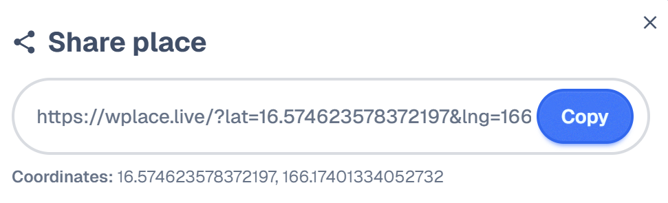
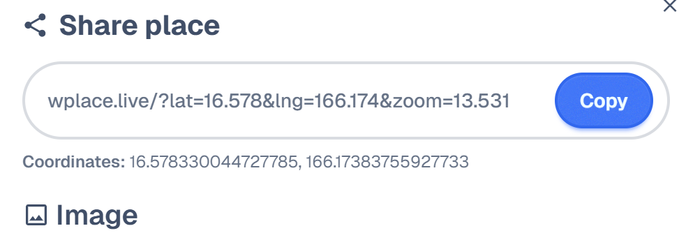

# Wplace_Shortlink
Wplace_Shortlink is a lightweight userscript that turns Wplace-share-link into concise shortlinks.

Quick installation: [Installation Link](https://github.com/lin-alg/Wplace_Shortlink/raw/refs/heads/main/Wplace_Shortlink.user.js)

Past:

Now:
